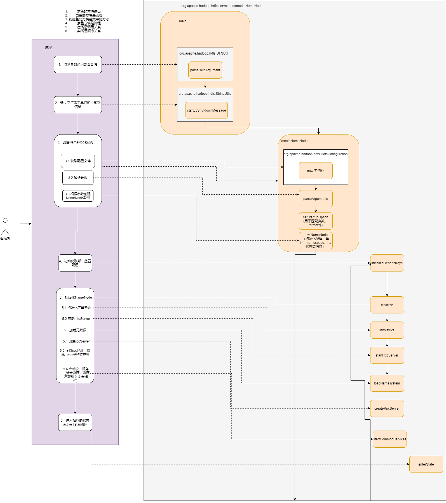

# 大数据（持续更新中...）

## 一、zookeeper

### 1、zkUtils

## 二、hadoop

### 1、namenode启动流程（更新中）

### 2、Datanode启动流程（更新中）

### 3、hadoop的metrics监测机制

#### （1）gauges字段

## 三、yarn

### 1、yarn的资源管理

## 四、spark

### 1、RDD和DataFrame的区别

### 2、广播变量

## 五、sparkSteaming

## 六、Scala

### 1、伴生对象

### 2、隐式转换

### 3、lambda表达式

## 七、Hbase

### 1、Hbase SQL

